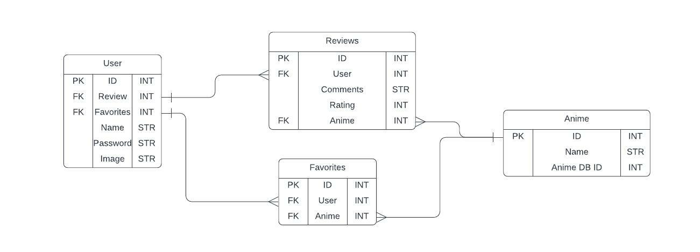

# Anime Review Site

A basic review site that allows users to create an account and save reviews for anime they have watched. The site has a user page that displays a list of anime reviews and ratings that the user has created. The site also has a search for anime that
displays the description and image of any anime.

## https://anime-review-site.herokuapp.com/

## Schema for the site:

## Api used:

https://kitsu.docs.apiary.io/

The main use of the API is to retrieve a list of anime based on a title search. The api also provides basic information about each anime, such as image and description.

## Flow of the site:

Upon visiting the site, users are prompted to login. There is a nav bar that allows for a user to sign up as well. Upon logging in, the user is directed to the user's page that displays all the anime and reviews for each. The user can navigate to the nav bar to a page to search for new anime to review.

## Technologies used:

- Flask: Base framework for the backend
- Javascript: For dealing with API calls and populating some information
- Python: Language used by Flask
- Ajax: Used to make API calls
- Css and HTML: Displaying and formating each webpage
- SQLAlchemy: Communication between Python and PSQL Database
- Heroku: Cloud Service for deploying the application
- WTForms: Displaying the search form and sign up form
- PostGres: Main Database technology
- Bcrypt: Encryption for user passwords
